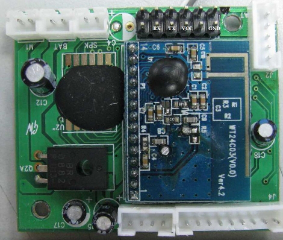

* Uncle Milton's Star Wars Force Trainer
* Use https://en.wikipedia.org/wiki/NeuroSky chip
* Base has serial pins 

* The serial speed is 57600 8N1
* Data looks like

41 47 0
41 56 0
41 56 0
41 56 0
29 69 0
29 69 0
29 69 0
29 61 0
29 61 0

* first digit is the Attention value.
* second digit is the meditation value.
* third digit is the connection quality.. 0 is OK any other value means the alectrodes are not properly set or you are moving too much.
* http://www.zibri.org/2009/09/success.html
* Additional info: http://hackaday.com/2009/10/21/mind-control-via-serial-port/ 